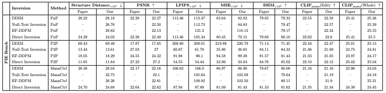
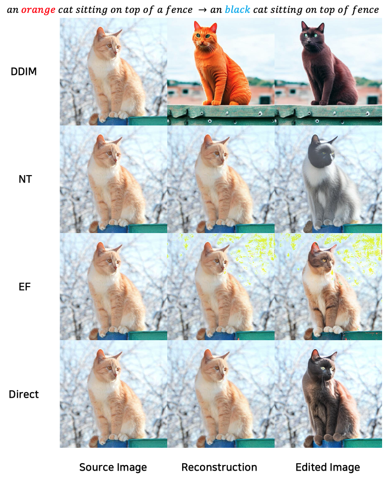
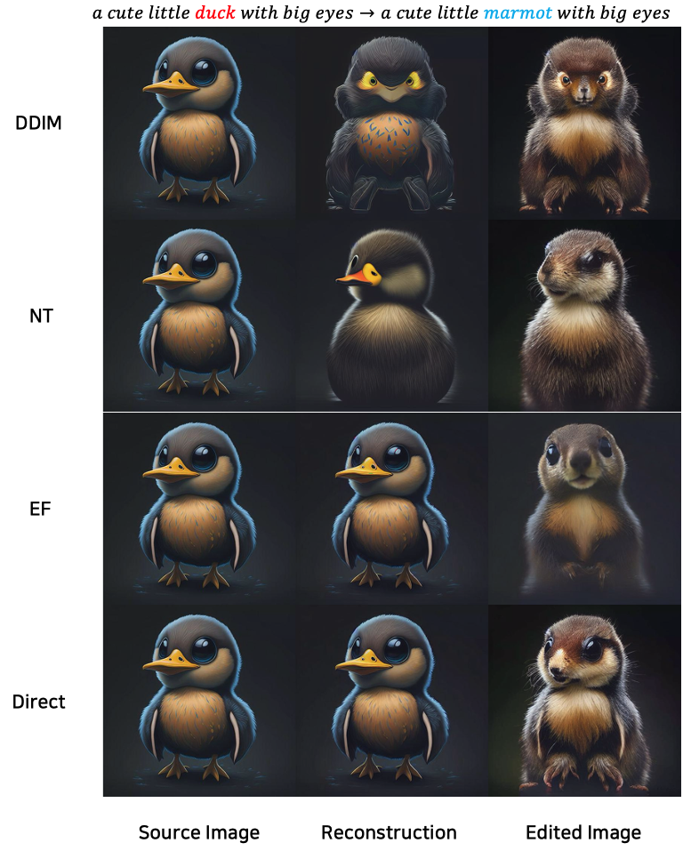
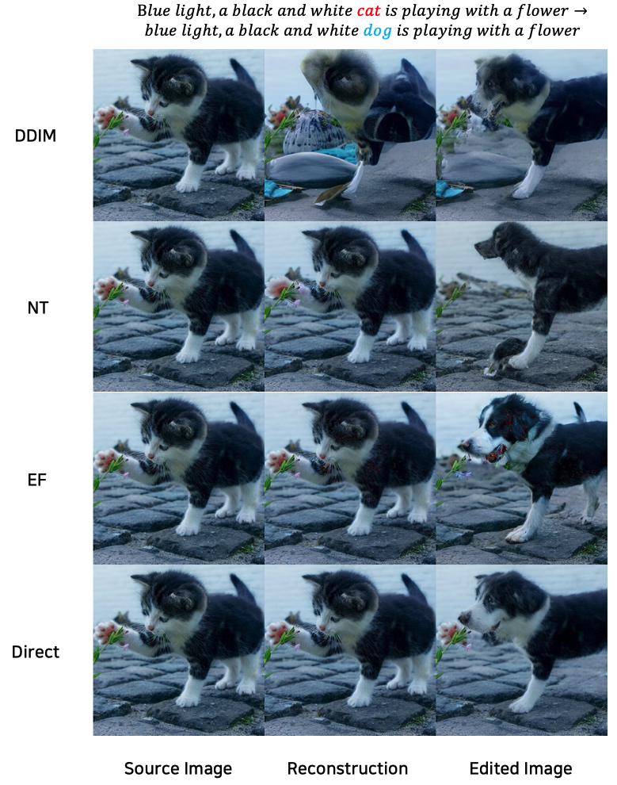

# Image Editing Studio (~ing)


This repository reproduces image editing methods using diffusion inversion methods.

Keywords: Diffusion Model, Image Inversion, Image Editing

## 🚀 Getting Started
<span id="getting-started"></span>

### 🌍 Environment Requirement
<span id="environment-requirement"></span>

- p2p_requirements.txt: for models in `run_editing_p2p.py`
- masactrl_requirements.txt: for models in `run_editing_masactrl.py`
- pnp_requirements.txt: for models in `run_editing_pnp.py`

For example, if you want to use the models in `run_editing_p2p.py`, you need to install the environment as follows:

```shell
conda create -n p2p python=3.9 -y
conda activate p2p
conda install pytorch==1.12.1 torchvision==0.13.1 torchaudio==0.12.1 cudatoolkit=11.3 -c pytorch
pip install -r environment/p2p_requirements.txt
```

## 🥇 Quantitative Results

<span id="quantitative-results"></span>

Reproduced quantitative results



- NT : [Null-Text Inversion](https://arxiv.org/abs/2211.09794)
- EF : [Edit-Friendly DDPM Inversion](https://arxiv.org/abs/2304.06140)
- Direct : [Direct Inversion](https://arxiv.org/abs/2310.01506)

## 🌟 Qualitative Results

<span id="qualitative-results"></span>

### Prompt-to-Prompt Qualitative Results



### Plug-and-Play Qualitative Results



### MasaCtrl Qualitative Results


## 💖 Acknowledgement
<span id="acknowledgement"></span>

Our code is modified on the basis of [direct-inversion](https://github.com/cure-lab/PnPInversion), thanks to contributors!
