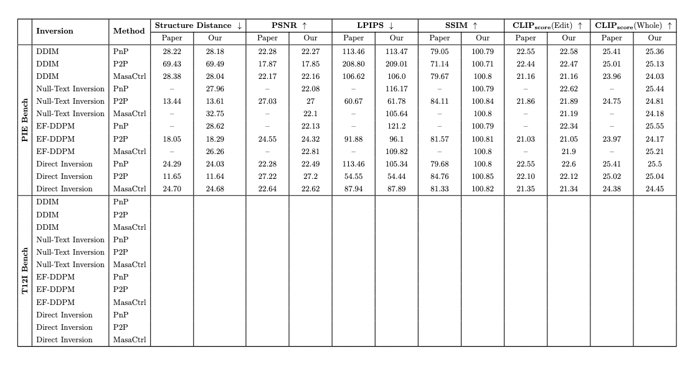

# Image Editing Studio (~ing)

This repository reproduces image editing methods using diffusion inversion methods.

Keywords: Diffusion Model, Image Inversion, Image Editing

## 💖 Acknowledgement

Our code is modified on the basis of [direct-inversion](https://github.com/cure-lab/PnPInversion), thanks to contributors!
