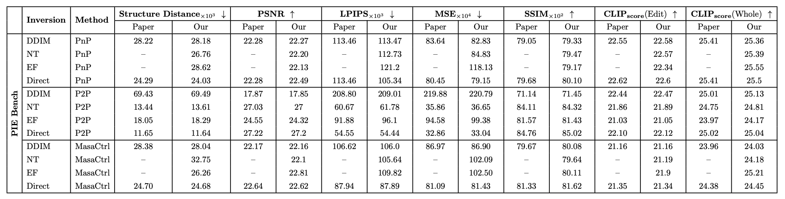

# Image Editing Studio


This repository reproduces image editing methods using diffusion inversion methods.

Report : [report](report/Report.pdf)

Keywords: Diffusion Model, Image Inversion, Image Editing

## Getting Started
<span id="getting-started"></span>

### Environment Requirement
<span id="environment-requirement"></span>

- p2p_requirements.txt: for models in `run_editing_p2p.py`
- masactrl_requirements.txt: for models in `run_editing_masactrl.py`
- pnp_requirements.txt: for models in `run_editing_pnp.py`

For example, if you want to use the models in `run_editing_p2p.py`, you need to install the environment as follows:

```shell
conda create -n p2p python=3.9 -y
conda activate p2p
conda install pytorch==1.12.1 torchvision==0.13.1 torchaudio==0.12.1 cudatoolkit=11.3 -c pytorch
pip install -r environment/p2p_requirements.txt
```
## Running Script
### Editing
```shell
python run_editing_p2p.py \
    --data_path "/home/poong/junseok/PIE_Bench" \
    --output_path "/home/poong/junseok/evaluation/PIE_Bench_output" \
    --edit_category_list 0 1 2 3 4 5 6 7 8 9 \
    --edit_method_list "directinversion+p2p"
```
### Evaluation
```shell
python evaluation/evaluate.py \
    --annotation_mapping_file "/home/poong/junseok/PIE_Bench/mapping_file.json" \
    --metrics structure_distance psnr_unedit_part lpips_unedit_part mse_unedit_part ssim_unedit_part clip_similarity_source_image clip_similarity_target_image clip_similarity_target_image_edit_part \
    --src_image_folder "/home/poong/junseok/PIE_Bench/annotation_images" \
    --tgt_methods 1_ddim+pnp 1_null-text-inversion+pnp 1_directinversion+pnp 4_edit-friendly-inversion+pnp \
    --result_path pnp_results.csv \
    --evaluate_whole_table
```
If you want average the results, run `evaluation/evaluate_final.py`

## Quantitative Results

<span id="quantitative-results"></span>

Reproduced quantitative results



- NT : [Null-Text Inversion](https://arxiv.org/abs/2211.09794)
- EF : [Edit-Friendly DDPM Inversion](https://arxiv.org/abs/2304.06140)
- Direct : [Direct Inversion](https://arxiv.org/abs/2310.01506)

## Qualitative Results

<span id="qualitative-results"></span>

| | Prompt-to-prompt | Plug-and-Play | MasaCtrl
| :-----: | :----: | :----: | :----: |
| Source Prompts | an orange cat sitting on top of a fence | a cute little duck with big eyes | blue light, a black and white cat is playing with a flower |
| Target Prompts | an black cat sitting on top of a fence | a cute little marmot with big eyes | blue light, a black and white dog is playing with a flower  |
| DDIM |  |   |  |
| NT |  |   |  |
| EF |  |   |  |
| Direct |  |   |  |


## Acknowledgement
<span id="acknowledgement"></span>

Our code is modified on the basis of [direct-inversion](https://github.com/cure-lab/PnPInversion), thanks to contributors!
